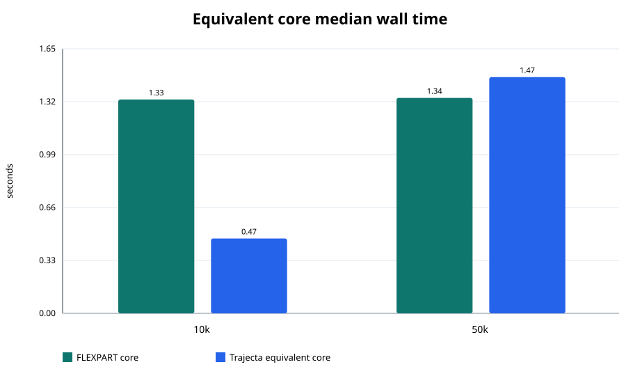
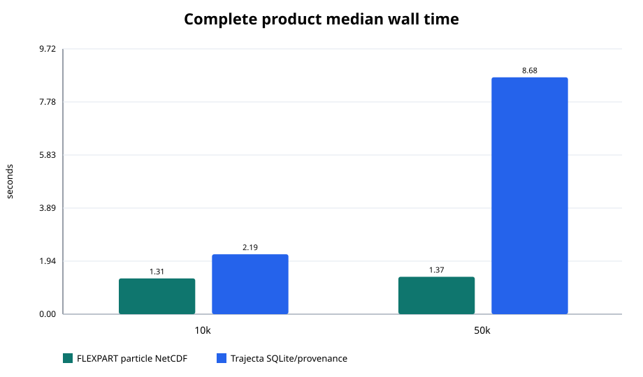
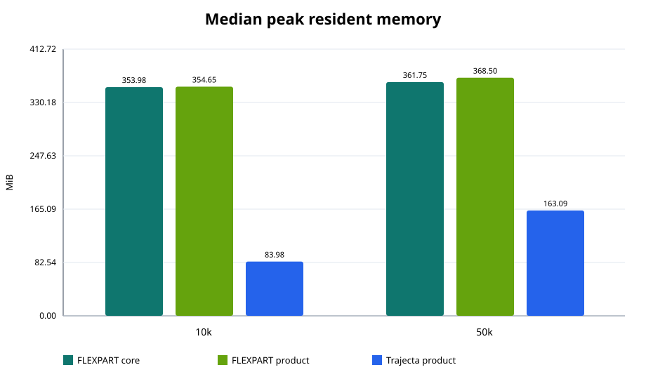

# Frozen data and charts

The publication bundle contains the aggregate comparison, the meteorological
alignment record, two analysis-ready CSV files, and five static Scalable Vector
Graphics (SVG) charts.
The files are committed with the documentation, so a chart remains tied to the
same rows when the site is rebuilt.

The source aggregate has SHA-256:

```text
b8d0f5befcf3bcf0c9cbf9ac70faa7ff708b676d906f6c27593d7202ab2a3b39
```

## Download the raw files

| File | Contents |
| --- | --- |
| [M5_A5_FLEXPART_COMPARISON.json](../assets/validation/raw/M5_A5_FLEXPART_COMPARISON.json) | Complete host and workload contract, executable identities, all run records, medians, scaling, scientific summaries, and check status |
| [M5_A5_METEOROLOGY_EQUIVALENCE.json](../assets/validation/raw/M5_A5_METEOROLOGY_EQUIVALENCE.json) | Source and staged file identities, array shapes, common-field classifications, GRIB packing checks, and alignment results |
| [M5_A5_TIMINGS.csv](../assets/validation/raw/M5_A5_TIMINGS.csv) | One row per warm-up or formal timing sample with wall time, RSS, CPU time, filesystem counters, mode, and order |
| [M5_A5_SCIENCE.csv](../assets/validation/raw/M5_A5_SCIENCE.csv) | One row per population, repetition, and common output time with the five cross-model ensemble measures |
| [PUBLICATION_MANIFEST.json](../assets/validation/PUBLICATION_MANIFEST.json) | Source aggregate hash and SHA-256 for every publication chart |

The `raw/original-charts` directory retains charts emitted by the formal run.
The publication copies below are regenerated from the aggregate. Their
scientific x-axis uses the recorded 20, 40, and 60 minute output instants.

## Read the timing CSV

`M5_A5_TIMINGS.csv` includes these columns:

| Column | Meaning |
| --- | --- |
| `particles` | Requested population size |
| `phase` | `warmup` or `formal` |
| `repetition` | Zero for warm-up; one through three for formal samples |
| `order_index` | Position of the mode in that repetition's rotated order |
| `mode` | `flexpart-core`, `flexpart-product`, or `trajecta-product` |
| `core_seconds` | Transport-oriented time when the mode exposes that boundary |
| `product_seconds` | Complete-product wall time when the mode exposes that boundary |
| `peak_rss_bytes` | Maximum resident set size reported for the process |
| `user_seconds`, `system_seconds` | CPU time from `/usr/bin/time -v` |
| `filesystem_inputs`, `filesystem_outputs` | Filesystem counters reported by the same tool |

Blank core or product cells indicate that the selected mode has only the other
timing boundary. Filter `phase == formal` before recalculating published
medians.

## Read the science CSV

`M5_A5_SCIENCE.csv` contains three output rows per repetition. Unix times map to
the following elapsed times:

| `physical_time_unix` | Elapsed time |
| ---: | ---: |
| 1543634400 | 20 minutes |
| 1543635600 | 40 minutes |
| 1543636800 | 60 minutes |

The remaining columns are measured in metres or dimensionless ratios as stated
in their names. Definitions and sign conventions are given in the
[scientific method](science.md).

## Publication charts

### Equivalent-core wall time



This chart compares the transport-oriented medians. The 10,000-particle values
are 1.330 seconds and 0.465 seconds; the 50,000-particle values are 1.340
seconds and 1.469 seconds.

### Complete-product wall time



This chart follows each program's selected product path. At 50,000 particles,
the values are 1.370 seconds for the particle NetCDF product and 8.680 seconds
for the Trajecta SQLite and provenance product.

### Throughput scaling


Throughput divides particle count by equivalent-core median seconds. The chart
shows the effect of fixed work in the short case as well as the population-
dependent transport cost.

### Peak resident memory



Peak RSS is the median process maximum from the three formal runs. Bytes are
converted to MiB using 1,048,576 bytes per MiB.

### Scientific ensemble comparison


The scientific chart displays horizontal centroid separation and signed
vertical centroid difference for both particle counts. Detailed dispersion,
transport-distance, and occupancy values remain in the CSV.

## Rebuild the charts

From the repository's `trajecta` directory, use the Python environment prepared
for the workspace tools:

```text
python tools/validate_m5_1_validation_assets.py
```

The command performs four checks:

1. the frozen aggregate status and source artifact hashes are read;
2. publication charts are regenerated in a temporary directory;
3. every generated chart hash is compared with `PUBLICATION_MANIFEST.json`;
4. English and Chinese validation asset trees are compared byte for byte.

It leaves the committed charts unchanged. A planned chart update begins with a
new frozen aggregate or a reviewed rendering change, followed by regeneration
and an updated publication manifest in the same commit.

## Use the data in another analysis

The CSV files can be loaded directly by R, Python, Julia, a spreadsheet, or a
command-line table tool. Keep `particles`, `phase`, `repetition`, and `mode` as
grouping columns when recalculating performance summaries. For scientific
rows, group by particle count and physical time; repetitions are separate
observations even when their current values match.

When citing a table or derived plot, record the aggregate SHA-256 shown at the
top of this page. It identifies the exact workload, executables, raw rows, and
derived values used by this publication bundle.
