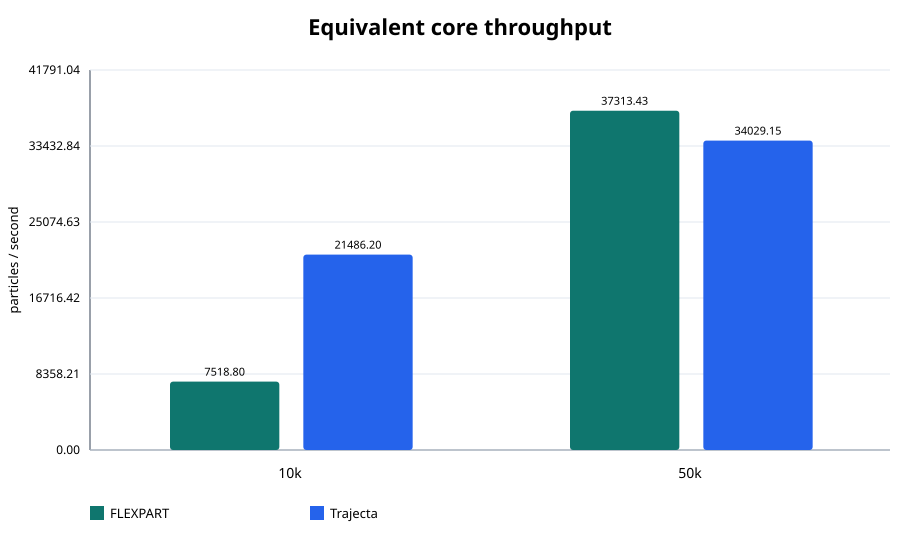
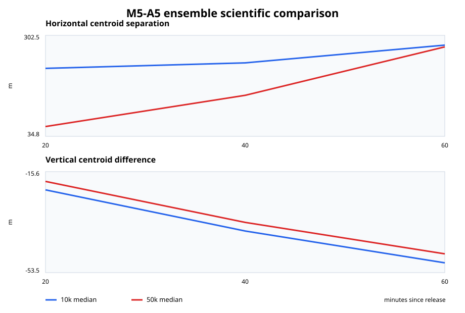

# 冻结数据与图表

通过的 aggregate SHA-256 为
`b8d0f5befcf3bcf0c9cbf9ac70faa7ff708b676d906f6c27593d7202ab2a3b39`。
发布图由其中的 `performance` 和 `scientific` 对象重建。CI 会将生成字节与
`PUBLICATION_MANIFEST.json` 逐一比较。

## 原始证据

- [对比 aggregate](../assets/validation/raw/M5_A5_FLEXPART_COMPARISON.json)
- [气象等价性](../assets/validation/raw/M5_A5_METEOROLOGY_EQUIVALENCE.json)
- [计时 CSV](../assets/validation/raw/M5_A5_TIMINGS.csv)
- [科学 CSV](../assets/validation/raw/M5_A5_SCIENCE.csv)
- [发布 manifest](../assets/validation/PUBLICATION_MANIFEST.json)

本地重建与校验命令：

```text
python tools/validate_m5_1_validation_assets.py
```

## 五张发布图

### Equivalent-core wall time


### Complete-product wall time


### Throughput scaling



### Peak resident memory


### 科学集合对比


